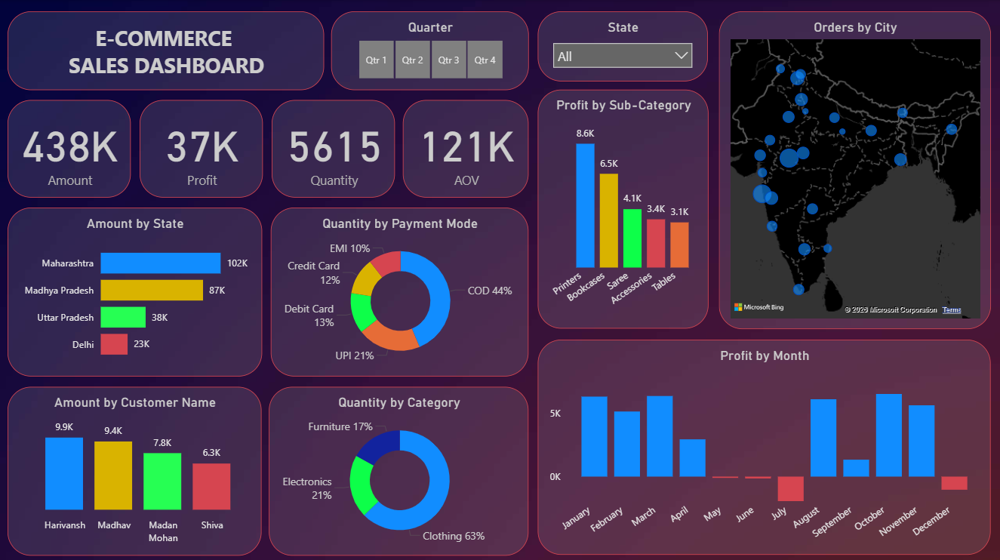

# E-commerce Sales Analysis using Power BI

## 📌 Project Overview

This project focuses on analyzing e-commerce sales data to gain actionable business insights using **Microsoft Power BI**. The dashboard provides a clear understanding of sales performance, customer behavior, product trends, and regional performance through interactive visualizations.

The project is suitable for data analytics portfolios and demonstrates skills in data cleaning, modeling, DAX calculations, and dashboard design.

## 🎯 Objectives

* Analyze overall sales and profit trends
* Identify top-performing products and categories
* Understand customer purchase behavior
* Analyze regional and state-wise performance
* Provide data-driven insights for business decision-making

## 🧩 Dataset Description

The project uses the following datasets:

* **Orders.csv**
  Contains order-level information such as order ID, order date, customer, state, category, sub-category, sales, quantity, and profit.

* **Details.csv**
  Contains additional transaction and product-related details supporting the analysis.

## 📊 Dashboard Features

* Total Sales, Profit, Quantity, and Average Order Value KPIs
* Category-wise and Sub-category-wise sales analysis
* Monthly and yearly sales trends
* State-wise and region-wise sales distribution
* Top customers and best-selling products
* Interactive filters and slicers for dynamic exploration

## 🛠 Tools & Technologies Used

* **Microsoft Power BI Desktop**
* **DAX (Data Analysis Expressions)**
* **Power Query (ETL & Data Cleaning)**
* **CSV Data Sources**

## 📁 Project Structure

```
E-commerce-Sales-Analysis/
│
├── E-commerce Dashboard.pbix   # Power BI report file
├── Orders.csv                  # Orders dataset
├── Details.csv                 # Additional details dataset
├── README.md                   # Project documentation
```

## 🚀 How to Use the Project

1. Clone or download this repository
2. Open **Power BI Desktop**
3. Open the file `E-commerce Dashboard.pbix`
4. Refresh the data to view the dashboard

## 📈 Key Insights

* Identified top-performing product categories contributing maximum revenue
* Observed seasonal trends impacting sales performance
* Highlighted high-profit regions and underperforming areas
* Analyzed customer contribution to overall sales

## 🖼️ Dashboard Screenshot

Below is a preview of the Power BI E-commerce Sales Dashboard:



